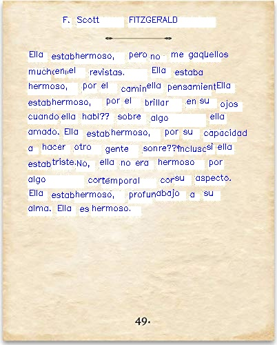

# Cam to text translator
A cam to tex translator using pytesseract and openCV.

## Installation

Clone this repo, install python requirements using requirements.txt.
Also install [Tesseract OCR](https://github.com/tesseract-ocr/tesseract) and specify the absolute path in the [main python file](main.py).

## Usage

Example code
```
Options:

-l, default='en', language code to translate to, see supported languages
-i, default='no', use image or not ('yes' or 'no')
-p, default='d:/dev/cam-to-text-translator/src/img/img1.jpg', absolute path to the image
-v, default='no', use video or not ('yes' or 'no')
-d, default='http://192.168.1.17:4747/mjpegfeed?640x480', video device 0 for laptop camera or ip address for ip camera


# translate from image
python src/main.py -l en -i yes -p d:/dev/cam-to-text-translator/src/img/img1.jpg

# stream from web cam
python src/main.py -l en -v yes -d http://192.168.1.17:4747/mjpegfeed?640x480

# stream from laptop camera
python src/main.py -l en -v yes -d 0
```

## Supported languages

1. Afrikaans - af
2. Irish - ga
3. Albanian - sq
4. Italian - it
5. Arabic - ar
6. Japanese - ja
7. Azerbaijani - az
8. Kannada - kn
9. Basque - eu
10. Korean - ko
11. Bengali - bn
12. Latin - la
13. Belarusian - be
14. Latvian - lv
15. Bulgarian - bg
16. Lithuanian - lt
17. Catalan - ca
18. Macedonian - mk
19. Chinese Simplified - zh-CN
20. Malay - ms
21. Chinese Traditional - zh-TW
22. Maltese - mt
23. Croatian - hr
24. Norwegian - no
25. Czech - cs
26. Persian - fa
27. Danish - da
28. Polish - pl
29. Dutch - nl
30. Portuguese - pt
31. English - en
32. Romanian - ro
33. Esperanto - eo
34. Russian - ru
35. Estonian - et
36. Serbian - sr
37. Filipino - tl
38. Slovak - sk
39. Finnish - fi
40. Slovenian - sl
41. French - fr
42. Spanish - es
43. Galician - gl
44. Swahili - sw
45. Georgian - ka
46. Swedish - sv
47. German - de
48. Tamil - ta
49. Greek - el
50. Telugu - te
51. Gujarati - gu
52. Thai - th
53. Haitian Creole - ht
54. Turkish - tr
55. Hebrew - iw
56. Ukrainian - uk
57. Hindi - hi
58. Urdu - ur
59. Hungarian - hu
60. Vietnamese - vi
61. Icelandic - is
62. Welsh - cy
63. Indonesian - id
64. Yiddish - yi

## Example
English to Spanish Translation
<table>
  <tr>
    <td align="center" style="font-weight:bold"> English </td>
    <td align="center" style="font-weight:bold"> Spanish </td>
  </tr>
  <tr>
    <td></td>
    <td></td>
  </tr>
</table>
